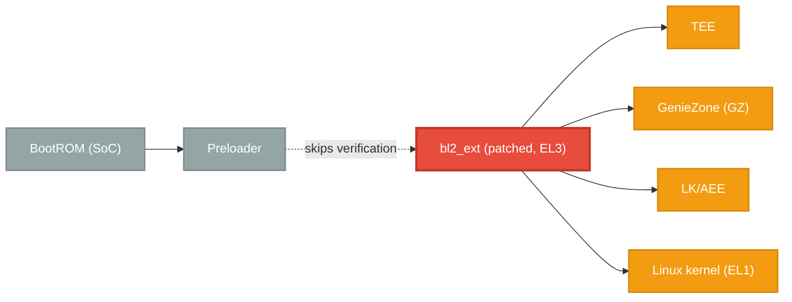

# fenrir

This is a PoC exploit for a vulnerability in the Nothing Phone 2a / CMF Phone 1 secure boot chain (and possibly other MediaTek devices).

It abuses a logic flaw where one component isn't properly verified if the seccfg unlock state is set to unlocked.

The exploit achieves code execution at EL3 and breaks the secure boot chain after Preloader execution.

>[!CAUTION]
> **I AM NOT RESPONSIBLE FOR BRICKED DEVICES. This exploit can permanently destroy your phone if something goes wrong.**

## Explanation
This exploit abuses a flaw in the MediaTek boot chain. When the bootloader is unlocked (seccfg), the Preloader skips verification of the `bl2_ext` partition, even though `bl2_ext` is responsible for verifying everything that comes after it.

The issue is critical because:
- Preloader jumps directly into `bl2_ext` while still running at EL3 (highest privilege level)
- `bl2_ext` controls the transition to EL1 and the non-secure world
- An unverified `bl2_ext` can load any subsequent images without checks

By patching `bl2_ext` to skip verification, the entire chain of trust collapses.

### Normal Boot Chain


### Exploited Boot Chain


The actual exploit just patches `sec_get_vfy_policy()` to always return 0, so an unverified `bl2_ext` running at EL3 now happily loads unverified images for the rest of the boot chain.

## Usage
Place your bootloader image in the `bin/` directory with your device codename (e.g., `bin/pacman.bin`)

Once you have your bootloader image ready, you can build the exploit using the provided `build.sh` script:
```bash
# Using default bootloader location (bin/[device].bin)
./build.sh pacman

# Using custom bootloader path
./build.sh pacman /path/to/your/bootloader.bin
```

After building, you should see a new file named `lk.patched` in the root directory. You can now flash this patched bootloader image to your device:
```
./flash.sh
```

> [!NOTE]
> If fastboot mode is not available on your device, you might have to use another method to flash the output image. The provided script assumes fastboot mode is available.

## Status
Currently, only the Nothing Phone 2a (`Pacman`) is supported by the exploit. The exploit is also known to work on the CMF Phone 1 (`Tetris`), but support for that device is still incomplete.

Adding support for a new device isn’t straightforward, but it is possible with some effort and reverse engineering. A good starting point is to check whether your phone’s `bl2_ext` partition is verified.

If it isn’t, you may be able to use the exploit. You can verify this by examining an `expdb` dump and looking for the `img_auth_required` flag when the partition is being loaded:
```
[PART] img_auth_required = 0
[PART] Image with header, name: bl2_ext, addr: FFFFFFFFh, mode: FFFFFFFFh, size:654944, magic:58881688h
[PART] part: lk_a img: bl2_ext cert vfy(0 ms)
```

The payload isn’t strictly necessary, it’s more of a neat addition to the exploit. At the moment, it can’t modify memory at runtime, as doing so triggers an MMU fault that I haven’t resolved yet.

What it can do is register custom fastboot commands, control the boot mode, and dynamically call any built-in bootloader functions on the fly (you can probably do more, just use your imagination).

In addition to patching `sec_get_vfy_policy()`, the included PoC also spoofs the device’s lock state as locked so you can pass strong integrity checks anywhere while being unlocked. In theory, it should work with custom ROMs as well, though I haven’t personally tested this yet (it may require some additional vbmeta adjustments).

Another device known to be affected by this vulnerability is the Vivo X80 Pro. From my previous testing, it didn’t even verify `bl2_ext` despite having a locked bootloader (which makes it even worse).

## TODO
- [ ] Add proper porting guide for new devices
- [ ] Fix MMU crashes when modifying memory at runtime
- [ ] Figure out proper payload appending method

## License

This project is licensed under the **GNU Affero General Public License v3.0 (AGPL-3.0)**.

Key points to be aware of:

* You are free to use, modify, and distribute the software.
* If you modify and use the software publicly, you must release your source code.
* You must retain the same license (`AGPL-3.0`) when redistributing modified versions.
* You cannot keep modifications private if the software is used to provide a networked service.

For full details, please refer to the [LICENSE](https://github.com/R0rt1z2/fenrir/tree/master/LICENSE) file.
