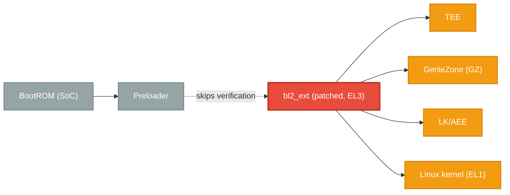

# fenrir

**Language:** [English](./README.md)

これは、Nothing Phone (2a) または CMF Phone 1 (おそらく他の MediaTek デバイスにも対応) のセキュアブートチェーンの脆弱性を悪用した PoC Exploit です。

seccfg のアンロック状態がアンロックに設定されている場合に、あるコンポーネントが適切に検証されないという論理的な欠陥を悪用します。

この Exploit は、EL3 でコード実行を実現し、Preloader の実行後にセキュアブートチェーンを破壊します。

>[!CAUTION]
> **デバイスの故障については責任を負いかねます。この Exploit を悪用すると、何らかの問題が発生した場合にデバイスがブリックする可能性があります。**

## 説明
この Exploit は、MediaTek ブートチェーンの脆弱性を悪用します。ブートローダーがアンロックされている場合 (seccfg)、Preloader は `bl2_ext` の検証をスキップします。しかし、`bl2_ext` パーティションは、その後に続くすべてのパーティションの検証を担っています。

この問題は重大です:
- Preloader は EL3 (最高権限レベル) で実行中に `bl2_ext` へ直接ジャンプします
- `bl2_ext` は EL1 と非セキュアワールドへの移行を制御します
- 検証されていない `bl2_ext` は確認なしで後続のイメージを読み込むことができます

`bl2_ext` にパッチを適用して検証をスキップすると、信頼できるチェーン全体が崩壊します。

### 通常のブートチェーン


### Exploit のブートチェーン


通常の Exploit は、`sec_get_vfy_policy()` をパッチして常に 0 を返すようにするだけなので、EL3 で実行されている未検証の `bl2_ext` は、ブートチェーンの残りの部分に対し未検証のイメージを問題なくロードするようになります。

## 使い方
ブートローダーのイメージをデバイスのコード名で `bin/` ディレクトリに配置します (例: `bin/pacman.bin`)

ブートローダーのイメージが準備できた後に提供されている `build.sh` スクリプトを使用して Exploit をビルドできます:
```bash
# Using default bootloader location (bin/[device].bin)
./build.sh pacman

# Using custom bootloader path
./build.sh pacman /path/to/your/bootloader.bin
```

ビルド後、ルートディレクトリに `lk.patched` という新しいファイルが作成されます。このパッチ適用済みのブートローダーイメージをデバイスにフラッシュすることができます:
```
./flash.sh
```

> [!NOTE]
> デバイスで fastboot モードが利用できない場合は、出力したイメージをフラッシュするための別の方法を使用する必要がある可能性があります。提供されているスクリプトは、fastboot モードが利用可能であることを前提としています。

## ステータス
現在、この Exploit は Nothing Phone (2a) (`Pacman`) のみをサポートしています。CMF Phone 1 (`Tetris`) でも動作することが確認されていますが、このデバイスへのサポートはまだ不完全です。

新しいデバイスのサポートを追加するのは簡単ではありませんが、ある程度の努力とリバースエンジニアリングを行えば可能です。まずは使用しているデバイスの `bl2_ext` パーティションが検証されているかどうか確認することをお勧めします。

そうでない場合 Exploit を使用できる可能性があります。これは `expdb` ダンプを調べてパーティションのロード時に `img_auth_required` フラグを確認しましょう:
```
[PART] img_auth_required = 0
[PART] Image with header, name: bl2_ext, addr: FFFFFFFFh, mode: FFFFFFFFh, size:654944, magic:58881688h
[PART] part: lk_a img: bl2_ext cert vfy(0 ms)
```

ペイロードは厳密には必須ではなく、Exploit への便利な追加機能です。現時点では実行時にメモリの変更をすることはできません。そうすると、まだ未解決の MMU エラーが発生するためです。

このツールで可能なことは、カスタム fastboot コマンドを登録してブートモードを制御やビルトインのブートローダー関数をオンザフライで動的に呼び出すことです (想像力を働かせれば、おそらく更に多くのことができるでしょう)。

`sec_get_vfy_policy()` へのパッチ適用に加えて、同梱の PoC はデバイスのアンロックステータスをロック状態として偽装するため、アンロックの状態でも Strong Integrity をパスできます。理論上はカスタム ROM でも動作するはずですが、個人的にはまだテストしていません (vbmeta の追加調整が必要になる可能性があります)。

この脆弱性の影響を受けることが知られているもう一つのデバイスは、Vivo X80 Pro です。以前のテストでは、ブートローダーがロックされているにも関わらず、`bl2_ext` の検証すら行われませんでした。

## TODO
- [ ] 新しいデバイス向けの適切な移植のガイドを追加
- [ ] 実行時にメモリを変更すると MMU がクラッシュする問題を修正
- [ ] 適切なペイロードの追加方法を理解する

## ライセンス

このプロジェクトは **GNU Affero General Public License v3.0 (AGPL-3.0)** に基づいてライセンスされています。

知っておくべき重要なポイント:

* 本ソフトウェアは自由に使用、改変、配布ができます。
* 本ソフトウェアを改変して公開する場合は、ソースコードを公開する必要があります。
* 改変した物を再配布する場合は、同じライセンス (`AGPL-3.0`) を適用する必要があります。
* ソフトウェアがネットワークサービスを提供するために使用される場合、変更を非公開にすることはできません。

詳細については [LICENSE](https://github.com/R0rt1z2/fenrir/tree/master/LICENSE) ファイルを参照してください。
